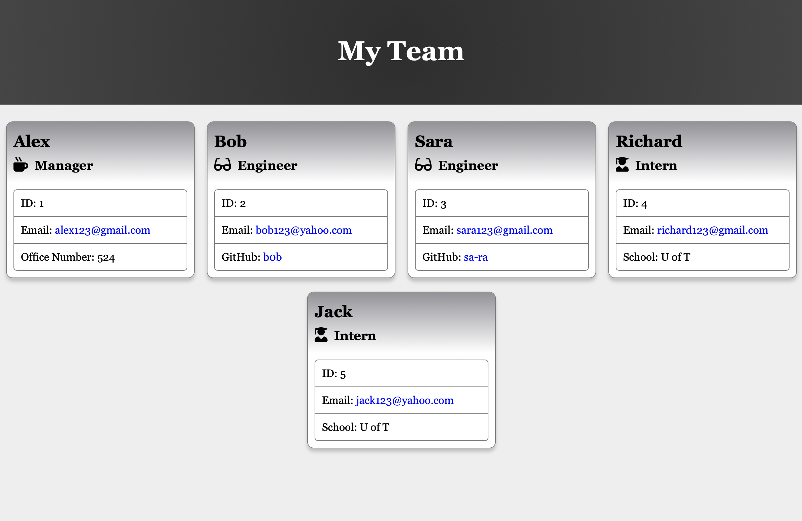

# Team Profile Generator

## Table of Contents
* [Description](#description)
* [Installation](#installation)
* [License](#license)
* [Webpage](#made-with)
* [Contribution](#contribution)

## Description
This app gives you as a manger, the ability to generate a webpage that displays your team's basic info, so you have quick access to their emails and GitHub profiles.

## Installation
The user must install Node prior to use the application. 
for more information about installing Node, you can look at their website [here](https://nodejs.org/en/)

## License
This project is licensed under the MIT license.

## Made with:
- Nodejs
- HTML
- CSS

## Contribution
Made By Ali Taghva
